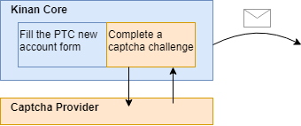
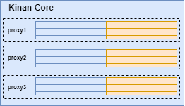

# KinanCity-core : CLI account creator

**TABLE OF CONTENTS**

- [What does Kinan Core do ?](#what-does-kinan-core-do)
- [Main usage and tips](#main-usage-and-tips)
- Configuration examples
  - [Create a sequence of accounts](#create-a-sequence-of-accounts)
  - [Create a batch from a csv](#create-a-batch-from-a-csv)
  - [Create a single account](#create-a-single-account)
- [Additional parameters](#additional-parameters)

# What does Kinan Core do ?

Instead of manually going to the PTC website, Kinan Core automates all the requests needed to create the account itself.

The captcha challenge still needs to be done, but you can use a third party provider (see below) or implement your own (see kinanCity-captcha-server).



In the end you will still need to take care of the activation link that will be sent by email.

Instead of doing these steps one by one, Kinan core does multi-thread the process (see -thread option below).

However PTC has some restrictions that only allows to create 5 accounts per 15 minutes from the same IP. 



To overcome that limit, Kinan Core includes an embedded cooldown system, and allows using multiple proxies to call PTC from several different IP addresses.

# Main usage and tips

KinanCity-core main class accepts configuration from :
- a set of **Command Line parameters** given at runtime
- a **config.properties** file you can create and customize from **config.example.properties**

**Note :**  A usage help is shown if called without any parameters or an invalid set of parameters.

**About Captchas**  
KinanCity needs to solve captchas and require a provider that will solve all captchas required. Providers requires an **apiKey** that must be given each time or saved in the config file. If you want to help, please use our referral links for these major providers. Price and performances may vary, please refer to discord feedback to make your choice. Some provider may also have trial offers.
- 2captcha : https://2captcha.com/?from=2219901
- Capsolver : https://dashboard.capsolver.com/passport/register?inviteCode=9q9A1XnPlPeu
- ImageTypers : http://www.imagetyperz.com/
- Anti Captcha : http://getcaptchasolution.com/2yh6yddsff


**Running in command line**  
The examples below only give the arguments that will follow the launch command : `java -jar KinanCity-core-<version>.jar`

Elements written between angle brackets (< >) are example values. Remove the brackets and use your own value.

For all these examples, the usernames and password must follow theses rules :  
- username : between 6 and 16 characters with no spaces
- password : with lower and uppercase letters, numbers and at least a symbol

## Create a sequence of accounts

`-m <email@domain.com> -f <aa***bb> -p <Passw0rd!> -c 20`  

will create 20 accounts using the pattern given replacing the stars by a incremental number, giving usernames from `aa001bb` to `aa020bb` with matching + trick emails `email+aa***bb@domain.com`

`-s 123` or `-startnum 123` will make the sequence start at 123 instead of 0.

## Create a batch from a csv file with a list of accounts

`-a pathTo/accounts.csv`

will create 1 account per line the the csv file.

### CSV Format

Countries and birthdates can be customised when using a CSV file, as long as you include the correct header columns. Columns can be any order, but the header row must be the first line and start with `#`.

`dob` should be in the format `YYYY-MM-DD`, and `country` is the two letter country code. For example:

```csv
#username;password;email;dob;country
jill141235;fhJ3%hfsd;jill141235@example.com;1982-12-25;GB
jill141236;fhJ3%hfsd;jill141236@example.com;1992-04-19;GB
jill141237;fhJ3%hfsd;jill141237@example.com;1987-10-03;GB
```


## Create a single account

`-u <username> -m <email@domain.com> -p <password>`

will create 1 account with given parameters.

## Interactive mode

`-i`

will start Kinan Core in inderactive mode, where just have to follow prompts.

# Additional parameters :

* `-cp <provider>` or `-captchaProvider <captchaKey>` to chose a provider between imageTypers|2captcha|antiCaptcha|capsolver|captchaai|local
* `-ck <captchaKey>` or `-captchaKey <captchaKey>` to give a specific apiKey add
* `-px [proxy1,proxy2,...]` or `-proxies [proxy1,proxy2,...]` to use multiple proxies.  
Or set them in the config file as `proxies=`  
anonymous proxy format is `ip:port` like `127.0.0.1:80`
proxy with auth format is `login:pass@ip:port` like `root:admin@127.0.0.1:80`
* `-t <12>` or `-thread <12>` to change the number of thread to 12 (default 5)
* `-npc` or `-noProxyCheck` will skip proxy check step at startup
* `-nl` or `-noLimit` will remove the policy that limits to 5 accounts per IP per 10 minutes

# Configuration File :
Additional configuration can be set using a config.properties file. You can start from the given config.example.properties and change values
