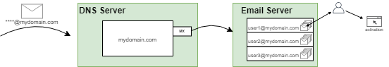
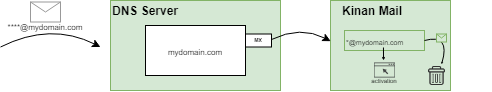

# KinanCity-mail : Email Activator

## About activation emails

Here is how activations emails work in a standard way : 

There are 2 part in an email address : after the @ symbol, is the internet domain where the email should be sent. And before the @ symbol is the username who this email should be delivered to.

PTC sends and email to the address you gave it.
It arrives to the DNS server of that domain, that defines to which server the the emails should be sent.

On that email server, there is a program setup with mailboxes for each user and the emails are stored.

Then the user connects to that mailbox and retreives his emails. He will then find the email with the activation link and open it in his browser.

## What this module does

If you have your own domain, you can run your own email server.
Instead of running a standard email server, you can run Kinan Mail instead.

This module can be run as a standalone service and will :

- Start a **Mail server** listening to default port 25
- For each mail received from nintendo, the **activation link** is grabbed
- A web request is made to the **activation** link

Using Kinan Mail, you don't need to create a mailbox for each account before hand. And the activation links are taken care automatically.

## How to setup

The machine running the email server must be accessible from **the internet**.
If needed, configure any router/firewall/proxy to redirect traffic from **port 25** to the host running the server.

You must own a domain name and have access to DNS entries
add a **MX entry** redirecting emails to the server.
You may need to add a **A entry** to map a DNS to your machine IP address, as MX entries do not work directly with IP addresses.

## How to run

### Basic usage

Run with java : `java -jar target/KinanCity-mail-<version>.jar` or double click on the jar file if your Operating System is configured for it.

### Advanced usage

KinanCity-mail has multiple modes, that can be choosen by adding the following modes after the command line

- *direct* (default) activates the accounts as the emails are recieved. The links and activation status will be logged in *links.log* file
- *log* will extract all incoming mail activation links, and just write them to *links.log* with the status *skipped*
- *file* will not receive any mail, but will process all lines from *links.log* marked has skipped (that could have been made)

example : `java -jar target/KinanCity-mail-<version>.jar log` for log mode.

### Running on alternate port

If you want to have Kinan Mail listen to another port the the default one (25) use a config.properties config file that contains a value for the key "port". Refert to config.example.properties for an example

Note: you will have to use a third party service listening to port 25 that will be setup to redirect emails to Kinan Mail on that new custom port.

## Notes

The server does not store received emails in any way. If the server is not running when the email is sent, or if it stopped before completing activation, then the activation link is lost forever.

As Mail Transfer Agents usually make a few retry, you could still start the server in time.

You may also grab the activation links manually from the application logs.

## FAQ

Q: I tried sending a mail to my server and got nothing.
A: To avoid spam, only emails incoming from pokemon are managed.

Q: How can I check if my DNS entries are correct ?
A: Use web based tools such as mxtoolbox.com

Q: I want to use another IP then my direct connection, or I am getting 409 errors, what can I do
A: Java supports native proxies : You can run Kinan Mail with additional command line parameters : 
-Dhttps.proxyHost=123.123.123.123 -Dhttps.proxyPort=3128
 