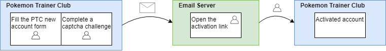

# KinanCity

Any issues with KinanCity, or you just want to talk about the project ? Go to [our discord server]( http://discord.gg/3jkb3zA)

## Were is Kinan City ?

**Kinan City** (キナンシティ) is one of the cities of the Kalos region in Pokemon XY games and anime.
It is known as **Kiloude City** is the English version and **Batisques** in French.

Kinan City is known for it **Friend Safari** where many trainer comes to find pokemon. This is a good place if you want to meet a **lot of new trainers**.

## How does one get a Pokemon Trainer Club account ?

In order to get a PTC account you need to go the pokemon website and request to create a new account, and complete theses steps.

You then first have to fill some personal informations such as your country and birthdate. Then information about the account you want.

You also need to complete a Captcha task to prove that you are a human.

One the subscription is done, the account still needs to be activated in the next 48 hours. An email will be sent to the given address with a link. You need to follow that link to activate the account.

NOTE : You cannot use the same email twice for multiple PTC account, they each need their own email address.

Theses steps must be done for each PTC account you want to create.

## What does KinanCity do ?

**KinanCity** is a tool that automates the creation of Pokemon Trainer Accounts and contains multiple modules when you need to create a lot of accounts, fast.

- **KinanCity-core** : is the core module that can also be used in command line. [more info here](KinanCity-core/README.md)
- **KinanCity-mail** : is a minimalist Email server that does auto-activation. [more info here](KinanCity-mail/README.md)

## Why another tool ?

There are already many accout creator with each their specific features.  
KinanCity was born by taking the best features of them to have a complete solution.

The advantages of KinanCity :
* is cross platform compatible (Unix, Windows, Mac)
* can work on headless systems without any need of a web driver
* does parallel processing to be faster
* can use multiple proxies to go over the limit of 30 accounts per hour (5 accounts per 10 minutes)

## How to install KinanCity ?

If you just want to **use Kinan Core and/or Kinan Mail**, you can get the last stable build [here]{https://github.com/drallieiv/KinanCity/releases}
or
To use the very last build of each module, you can **download** the latest version of each maven module [here](https://github.com/drallieiv/KinanCity/packages)
or  
You can **compile** it yourself using a **maven** goal : `mvn package`  

**KinanCity** modules are java applications and all you need is a Java 8 Runtime Environment on your system.

### References

KinanCity is born from previous projects :

* [pikaptcha](https://github.com/sriyegna/Pikaptcha) by [sriyegna](https://github.com/sriyegna)
* [PalletTown](https://github.com/novskey/PalletTown) by [novskey](https://github.com/novskey)
